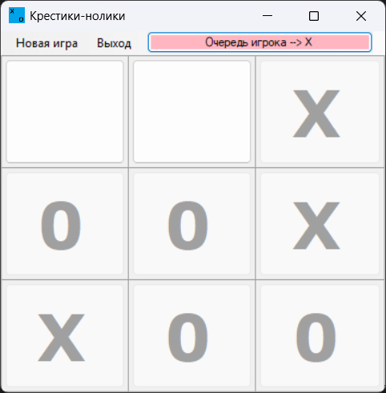

# ✕ Tic-Tac-Toe &nbsp;·&nbsp; GameXO

> Classic **X vs O** desktop game — two players, one keyboard, zero mercy.


---

## Screenshot

> Add a screenshot or GIF here: place it at `assets/screenshot.png` and uncomment the line below.

<!--  -->

---

## Features

- **Two-player local** gameplay — take turns on the same machine
- **Instant New Game** — reset the board in one click without restarting the app
- **Win & draw detection** — all 8 winning lines checked after every move
- **Clean, minimal UI** — 3×3 grid, large symbols, no distractions

---

## Tech Stack

| Layer | Technology |
|---|---|
| Language | C# |
| UI Framework | Windows Forms (WinForms) |
| Runtime | .NET Framework 4.x |
| IDE | Visual Studio |

---

## Getting Started

### Prerequisites
- Windows OS
- Visual Studio 2019 or later (Community Edition is fine)

### Build & Run

```bash
git clone https://github.com/<your-username>/Game_Tic-tac-toe.git
cd Game_Tic-tac-toe/GameXO
```

1. Open `GameXO.sln` in Visual Studio
2. Press **F5** to build and run

No NuGet packages, no external dependencies — it just works.

---

## How to Play

1. **X always goes first.** Click any empty cell to place your symbol.
2. **Get three in a row** — horizontally, vertically, or diagonally — to win.
3. If all 9 cells fill up with no winner, it's a **draw**.
4. Click **New Game** in the menu to play again.

---

## Project Structure

```
GameXO/
├── Game.cs              # Game state & win-detection logic
├── FormGame.cs          # UI event handlers & turn management
├── FormGame.Designer.cs # WinForms designer-generated layout
└── Program.cs           # Entry point
```

---

## License

Distributed under the [MIT License](LICENSE). © 2026 Denis Mikhalev.
